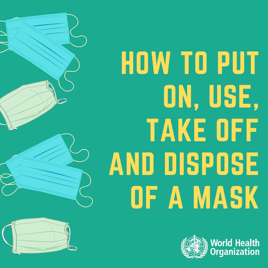
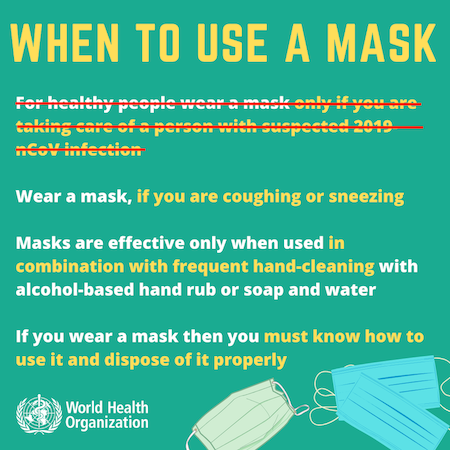
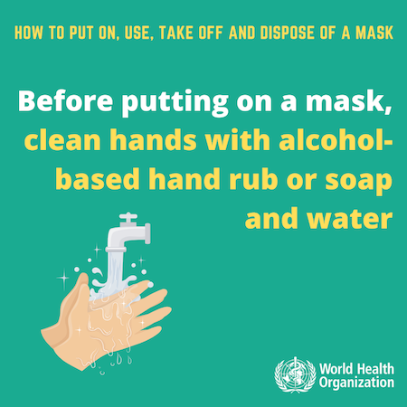
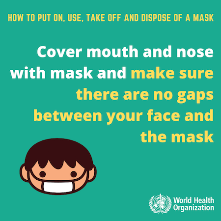
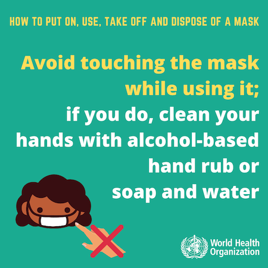
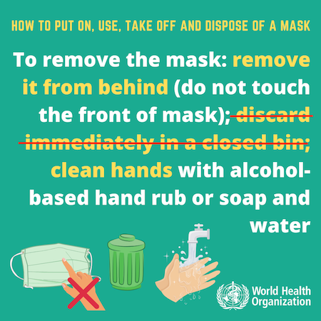

Everyone can do their part in preventing the spread of Covid-19. We made some masks in our house and distributed them to our neighbours. 
Get in touch at diymasks1612@gmail.com .

There are some important things you need to do now, and for the foreseeable future, in order to limit the chance of you getting infected, or infecting others. These are listed here in rough order of importance:

- **stay away from other people**. This reduces the risk of getting in touch with someone who is sick, putting you at risk of contracting the disease, and reduces the risk that you, who may have been infected, in turn spread the disease to others.
- **wash your hands** frequently with soap and water. The virus can get into you through your mouth, nose and eyes. This can happen because you are in close contact with someone who is sick, who directly passes it on to you, or it could be because you touch with your hands a surface contaminated with the virus. In the latter case, if you touch your face/nose/mouth/eyes with your hand, you have a high chance of being infected. Washing your hands removes the virus from your hands and reduces the chances it may enter your body.
- **avoid touching anything that is not essential**, and try not to touch personal objects with the same hand you used to, e.g.: open the door to a shop. If your hands have touched a contaminated surface, they will contaminate **everything you touch** (e.g.: your phone, house keys, payment cards, pockets). 
- if you really have to be in contact with other people (e.g.: going to work or shopping), then you can **wear a face mask** that covers nose and mouth. This heavily reduces the amount of virus-containing particles that can spread from the respiratory system of an infected person. It also reduces the chances that healthy subjects contract the virus, as droplets expelled by sick people would have a harder time reaching their mouth and eyes. Remember: **wearing a face mask is not an iron-clad. You still need to stay as far as possible from other people, wash your hands, do not touch your face, and use the mask properly in order for it to protect you and others**.

## Summary of our view on the current face masks situation

There is a global shortage of off-the-shelf, certified face masks and respirators, and as such they should be reserved for healthcare workers and people with symptoms. If you are not in one of these categories, you probably don't need such a mask. You can make your own at home, using some of the resources below. Notice that the requirements for healthcare workers are different from that of general population: healthcare workers have to protect themselves from being in close contact with infected people, whereas members of the general population have to protect others from the infection they may be carrying. As a member of the general population, you have to consider that you may be knowingly or unknowningly infected, and you can prevent the spread of the virus to others by, besides staying away from other people, wearing a face mask. The mask will reduce the amount of infected particles that you will release in the environment around you.

## How to use a face mask properly

What mask should you use?

You should get a surgical-like or DIY mask without filter. Respirators (masks with filters, such as FFP2/FFP3/KN95) require proper training to be efficient, and can be worse than a DIY cloth mask if not worn properly. Furthermore, the few ones available should be left for frontline health workers. See [here](https://www.airplus-family.com/the-difference-between-an-n95-mask-and-a-surgical-mask/) for a more in-depth explanation.

The key points are:

- a mask should cover your **nose** and **mouth**
- your hands should be clean when you put it on and remove it (remember: your hands need to be clean to touch your face)
- you should prevent the outside of the mask from touching your face (remember: if the mask prevented any infected droplets from getting into your mouth/nose, they will be right there *on the mask*. You don't want to rub them on your face)
- different type of masks have different durability. Some can be reused, some can be washed. In general, if the mask is damp, it needs to dry before you can reuse it. If the mask has holes or is falling apart, it should be discarded. If your mask is reusable, to avoid being infected by the particles it may have collected, you can store it in a safe place (e.g.: a plastic bag) for 4 days before taking it out and letting it dry.

The images below are from the World Health Organization [website](https://www.who.int/emergencies/diseases/novel-coronavirus-2019/advice-for-public/when-and-how-to-use-masks). We amended them (and omitted one) in line with our advice to reuse masks.

Our take: the general public should use a mask every time you get out of the house, and within the house if someone you live with is infected.

Our take: depending on the type of mask, you may not need to discard it. 

## Selected quotes

[(National Center for Biotechnology Information) Testing the efficacy of homemade masks: would they protect in an influenza pandemic?](https://www.ncbi.nlm.nih.gov/pubmed/24229526)

> Our findings suggest that a homemade mask should only be considered as a last resort to prevent droplet transmission from infected individuals, but it would be better than no protection.

[(Bloomberg) Mask or No Mask? Why the Guidance Has Been Shifting
](https://www.bloomberg.com/news/articles/2020-03-06/mask-or-no-mask-what-the-virus-experts-have-to-say-quicktake)

> The evidence so far is that the novel coronavirus spreads in respiratory droplets - spatters of liquid expelled when an infected person coughs, sneezes or even speaks. These droplets are usually heavy enough to fall immediately to the ground or surrounding surfaces. Transmission can occur if the droplets reach the mouth, nose or eye of someone nearby, either directly or from an unwashed hand that’s touched a contaminated object or surface. When an infected person wears a face cover, the droplets can be caught by the mask rather than being expelled. In theory, wearing a face covering could also help protect people who are uninfected, if it stops them from touching their face. However, according to the WHO, there is currently "no evidence" that public mask wearing by healthy people prevents infection with respiratory viruses such as the one that causes Covid-19.

[(The Guardian) Can a face mask protect me from coronavirus? Covid-19 myths busted](https://www.theguardian.com/world/2020/apr/11/can-a-face-mask-protect-me-from-coronavirus-covid-19-myths-busted)
> Wearing a face mask is certainly not an iron-clad guarantee that you won’t get sick – viruses can also transmit through the eyes and tiny viral particles, known as aerosols, can penetrate masks. However, masks are effective at capturing droplets, which is a main transmission route of coronavirus, and some studies have estimated a roughly fivefold protection versus no barrier alone (although others have found lower levels of effectiveness).
> If you are likely to be in close contact with someone infected, a mask cuts the chance of the disease being passed on. If you’re showing symptoms of coronavirus, or have been diagnosed, wearing a mask can also protect others. So masks are crucial for health and social care workers looking after patients and are also recommended for family members who need to care for someone who is ill – ideally both the patient and carer should have a mask.

## How to make your own mask

There are plenty of resources online, for instance:

https://www.youtube.com/watch?v=5cAmdlgYI_E

https://www.youtube.com/watch?v=uZetqMfWXKk

https://www.youtube.com/watch?v=9yP_fnr4oVY

https://diymask.github.io/

To make our masks we followed the video below. It is in a foreign language, but it should be fairly easy to understand it anyhow. It uses pet training pads, which have one side covered by a comfy soft absorbing pad and the other one covered by plastic protective sheet wich ensures the vast majority of the fluids escaping your mouth and nose will get trapped in the absorbing part. This also makes it harder for fluids emitted by other people to reach your mouth and nose. We cut out of the pads a rectangle about 24cm x 16cm, and a 30cm length of elastic band of the type you'd use for sewing. Watching the example in the video, we folded the pad and stapled the elastic band to the pad. 

<video height="720" controls>
  <source src="masks-video.mp4" type="video/mp4">
  Your browser does not support the video tag.
</video>

We used the following items from Amazon:

- [50 pet training pads](https://www.amazon.co.uk/gp/product/B00MW8G3YU) You can make six masks out of one of these pads (enough for 300 masks).
- [elastic cord](https://www.amazon.co.uk/gp/product/B00ECZOZIW/) (this was shorter than advertised, as we only got enough for 60 masks instead of 100 as you'd expect for a 30m roll and 30cm per masks)
- [1 stapler](https://www.amazon.co.uk/gp/product/B07CTRZSGD/)
- you also need scissors, we didn't buy them as we had them at home

**Please note: do not buy the above if you are only doing a couple of masks for you and your household.** Only buy them if you are planning on doing a large numbers of masks for the benefit of others. Elastic bands are really scarce these days and you wouldn't want to have a several meters of unused elastic band in your home while preventing others from making masks.

Also note: the elastic cord we used is suboptimal for the job and it is not suitable for ear loops becasuse it is too wide and too stong (not stretchy enough). Ideally you'd have some more stretchable and loose elastic cord, of the type found on real face masks. [This](https://www.amazon.co.uk/White-Elastic-Earloop-Strap-Sewing/dp/B086MYP5YT/) would have been a better option, but, as you'd expect, it is backordered. As demonstrated in the video, ear loops can be made with office rubber bands as well.

## FAQ

### Why do you do this? Do you want my money? Are you making any money out of this?

No. We are trying to be useful.

### Are you a doctor?

We are a doctor of philosophy and an aspiring doctor of phylosophy. No medical doctors here.

### Full disclosure

The WHO seems to be still advising against use of masks for the general healthy population (see, e.g.: [here](https://www.theguardian.com/world/2020/apr/07/face-masks-cannot-stop-healthy-people-getting-covid-19-says-who)).

> Heymann said masks could create a false sense of security that could end up putting people at greater risk. Even with the mouth and nose fully covered, the virus can still enter through the eyes.

It's interesting that at the same time they recommend it for those more at risk:

> “It would be helpful if high-risk people – elderly, people with chronic conditions – wear a face mask if they can’t avoid crowed areas, because these people have the highest risk of severe outcomes such as ICU/death if infected,” she said.

Their mixed message, we understand, is because of a mix of the following reasons:
- wearing a mask does not give full protection and can give a false sense of security
- people wearing a mask need to learn to use it properly to maximise its effectiveness
- commercially available masks should be left for frontline health workers, and the market would not be able to provide enough for the general population

To which our answer is:
- use masks *in addition to* social distancing, frequent handwashing and do not take any risks
- learn how to use masks properly
- make your own masks

### Is the 1612 in your email a Vulfpeck reference?

No, it's the code to [my heart](https://www.youtube.com/watch?v=jRHQPG1xd9o).
